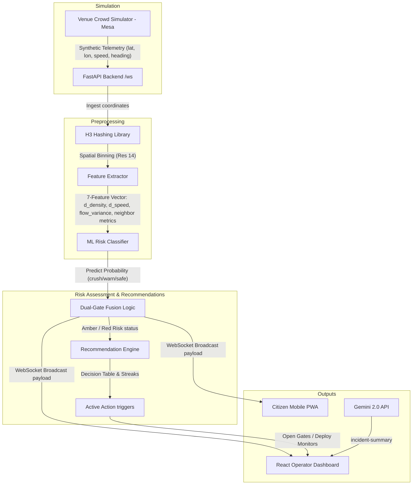
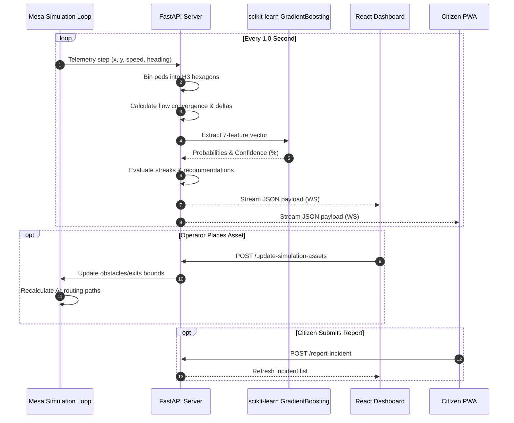

# CrowdShield — System Architecture

The following Mermaid diagrams illustrate the real-time data ingestion, spatial aggregation, machine learning prediction, and recommendation dispatch pipeline.

---

## 1. System Components & Ingestion Pipeline

---

## 2. Ingestion & Event Sequence

